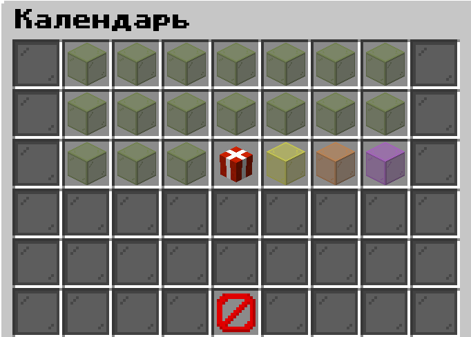

# Calendar | Ежедневные награды

[](https://www.minecraft.net/)
[](https://papermc.io/)

Плагин для серверов Minecraft Paper 1.21.10, который автоматически выдает награды игрокам за количество дней входа на сервер в течение месяца. Идеально подходит для повышения ежедневной активности игроков!

## 📖 Описание

**Calendar** — это система наград за ежедневные входы, которая работает автоматически. Игрокам не нужно ничего открывать или кликать — награды выдаются сразу при входе на сервер. Плагин отслеживает количество уникальных входов каждого игрока в течение месяца и выдает соответствующие награды.

**Ключевые особенности:**
- **Автовыдача:** Награды выдаются мгновенно при входе в игру
- **Гибкая настройка:** Настройте любые награды за любое количество входов
- **Автоматический сброс:** Прогресс всех игроков автоматически сбрасывается в начале каждого месяца
- **Простой интерфейс:** Игроки могут посмотреть свой прогресс и доступные награды через меню
- **MiniMessages** - Поддержка MiniMessages форматирования для сообщений и предметов

## ⚙️ Команды

**Для всех игроков:**
- `/calendar` — Открывает меню для просмотра календаря наград и своего прогресса

**Для администраторов (требуется право `calendar.admin`):**
- `/calendar reload` — Перезагружает конфигурацию плагина (config.yml, меню, награды)
- `/calendar resetall` — Сбрасывает количество входов у всех игроков вручную

## 🔧 Настройка прав (Permissions)

| Право | Описание | Кому выдавать |
|-------|-----------|----------------|
| `calendar.admin` | Дает доступ к административным командам (`reload`, `resetall`) | Администраторам |

**Примечание:** Команда `/calendar` доступна всем игрокам по умолчанию без необходимости выдачи прав.

## 📁 Конфигурация

### config.yml
```yaml
prefix: "<gray>[<aqua>Календарь</aqua>]</gray>"

messages:
  # Общие сообщения
  new-month: "<gold>Наступил новый месяц! Система ежедневных наград сброшена. Заходите каждый день чтобы получить все награды!"
  already-claimed-today: "<yellow>Вы уже получали награду сегодня. Следующую награду можно будет получить завтра!"
  no-inventory-space: "<red>У вас нет места в инвентаре для награды! Используйте <yellow>/calendar</yellow> чтобы получить её позже."
  all-rewards-claimed: "<gold>Поздравляем! Вы получили все награды за этот месяц! Ждём вас в следующем месяце."
  progress: "<gray>Ваш прогресс: <yellow>{claimed}</yellow>/<gold>{total}</gold> наград получено"
  item-dropped: "<red>Предмет {item} выпал на землю из-за нехватки места в инвентаре!"
...
```

### rewards.yml
В этом файле настраиваются награды за определенные дни входа (название и колечество наград может быть любым)

```yaml
weekday-rewards:
  days:
    - 1-5
    - 8-12
    - 15-19
  commands:
    - give %player% cookie 8
    - give %player% experience_bottle 10
    - money give %player% 500
  message: '<color:#33aaff>Вы получили награду за день {day}!</color>'

saturday-rewards:
  days:
    - 6
    - 13
    - 20
  items:
    item1:
      material: DIAMOND
      amount: 3
    item2:
      material: ENCHANTED_GOLDEN_APPLE
      amount: 1
  commands:
    - money give %player% 500
  message: '<gradient:#ffaa00:#ffcc44>Вы получили награду за день {day}!</gradient>'
...
```

### menu.yml
В этом файле настраивается внешний вид интерфейса календаря. (названия и колечество внутри presents может быть любым)

```yaml
title: "<gradient:#6a0dad:#8a2be2>Ежедневные награды</gradient>"
# графический интерфейс может содержать от 1 до 6 строк
rows: 6

# ----- Предметы -----

filler:
  material: BLACK_STAINED_GLASS_PANE
  name: ''
  slot:
    - 0-53

close:
  slot: 49
  material: BARRIER
  name: '<red><bold>Закрыть</bold></red>'
  lore: |
    
    <gray>Нажмите здесь чтобы закрыть!</gray>

presents:
  weekday:
    slot:
      - 1-5
      - 10-14
      - 19-23
    # К каким дням привязан пункт меню
    days:
      - 1-5
      - 8-12
      - 15-19
    # показывается, когда подарок может быть получен
    item-claimable:
      material: PLAYER_HEAD
      texture: eyJ0ZXh0dXJlcyI6eyJTS0lOIjp7InVybCI6Imh0dHA6Ly90ZXh0dXJlcy5taW5lY3JhZnQubmV0L3RleHR1cmUvMjJiN2I5ZTA3YzM1MGJjZDY2MmJjZjNmMTYyNGE1OGU5NjVhNzZlYTAxOTE2ZGQzM2M0NzViZDFmYzg2OTQ3YiJ9fX0=
      name: '<gradient:#00ff00:#32cd32><bold>День {day}</bold></gradient>'
      lore: |
        
        <gray>-</gray> <white>Забирай свой подарок!</white>
        (10 пузырьков опыта, 500 монет, 8 печенек)
        
        <gradient:#00ff00:#32cd32>Нажмите здесь чтобы получить</gradient>
    # показывается, когда подарок уже получен
    item-claimed:
      material: GREEN_STAINED_GLASS
      name: '<gradient:#008000:#006400><bold>День {day}</bold></gradient>'
      lore: |
        
        <gray>-</gray> <white>Вы уже получили этот подарок!</white>
        (10 пузырьков опыта, 500 монет, 8 печенек)
        
        <gradient:#008000:#006400>Уже получен</gradient>
    # показывается, когда подарок не может быть получен
    item-unclaimable:
      material: YELLOW_STAINED_GLASS
      name: '<gradient:#ff3333:#cc0000><bold>День {day}</bold></gradient>'
      lore: |
        
        <gray>-</gray> <white>Подарок можно открыть в: <gradient:#ff9999:#ff6666>{time}</gradient>!</white>
        (10 пузырьков опыта, 500 монет, 8 печенек)
        
        <gradient:#ff3333:#cc0000>Возвращайтесь позже</gradient>
...
```
### Как настроить награды:

В файле `rewards.yml` в `награде` укажите дни входа и награды, которые будут выданы при достижении этого количества.

**Доступны два формата наград:**

#### 1. Выдача через команды
#### 2. Выдача предметов

**Важные заметки:**

- Используйте плейсхолдер `%player%` вместо ника игрока в командах
- Поддерживаются любые команды, которые понимает ваш сервер (включая команды от других плагинов)
- Можно использовать оба формата одновременно для разных дней

## 🖼️ Скриншоты



*Интерфейс плагина, где игроки видят свои полученные и будущие награды.*

## 📥 Установка

1. Скачайте **последний релиз** из раздела [Releases](../../releases)
2. Поместите файл `.jar` в папку `plugins` вашего сервера
3. Перезагрузите или запустите сервер (`/reload` или полная перезагрузка)
4. Настройте плагин под свои нужды, отредактировав файлы в папке `plugins/Calendar/`:
    - `config.yml` - для настроек сообщений
    - `rewards.yml` - для настроек наград
    - `menu.yml` - для настроек интерфейса
5. Используйте `/calendar reload` для применения изменений

## 🤝 Поддержка и Баги

Если вы нашли ошибку или у вас есть предложение по улучшению плагина, создайте **Issue** на странице проекта GitHub.

## 📜 Лицензия

Этот проект лицензирован под MIT License.
